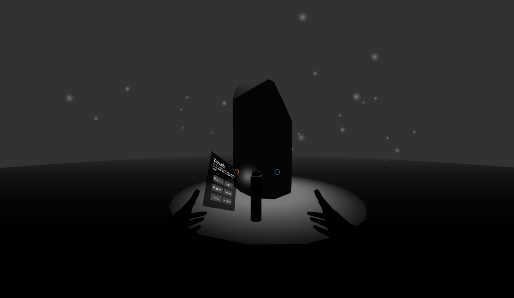
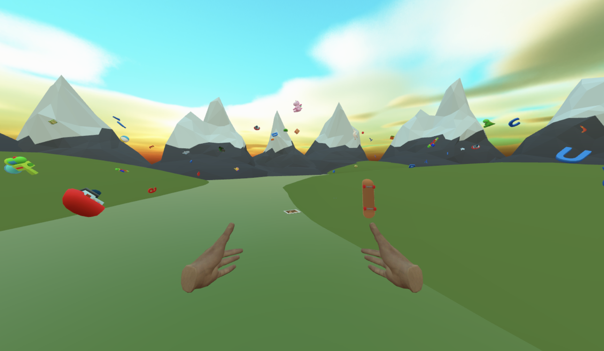
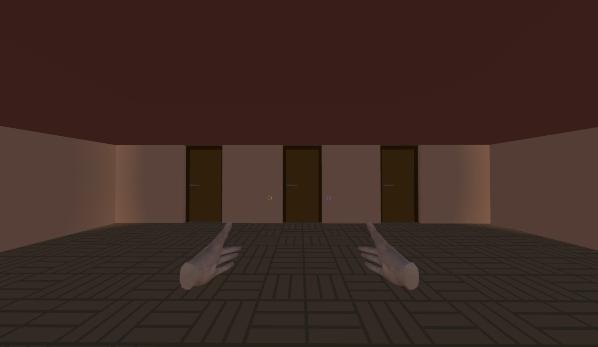
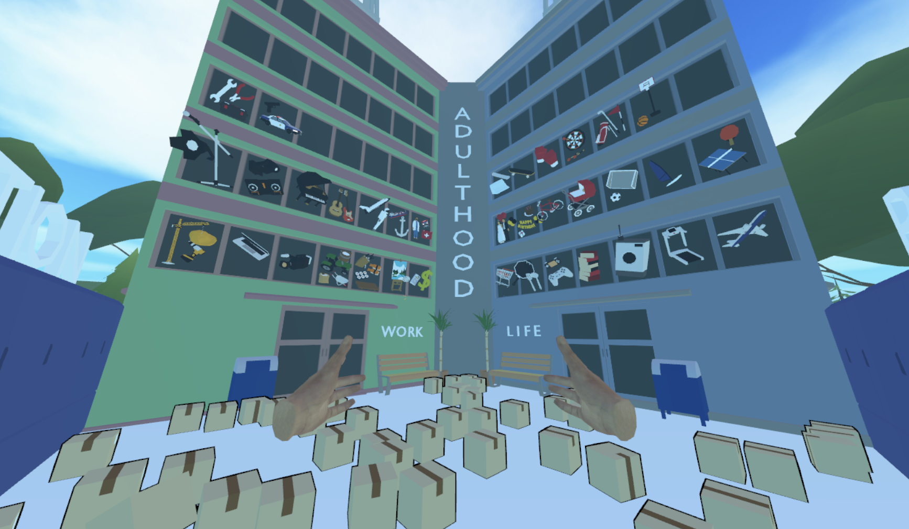
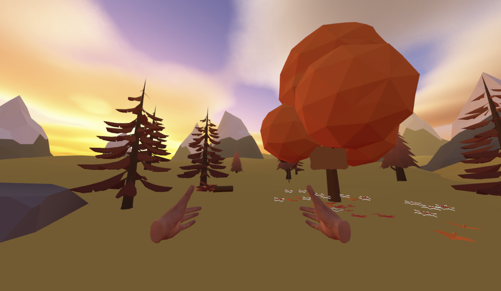
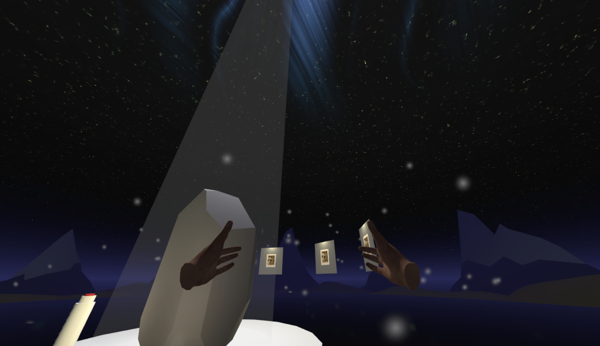

# Mystery to Memory: A Journey through a Life Well Lived

### A VR project in collaboration with Direct Funeral Services

### Project Overview
From Mystery to Memory is an immersive VR experience designed to transform how younger individuals connect with deceased loved ones during funeral services. This interactive journey allows users to explore the life stages of the deceased through metaphorical environments, helping bridge the emotional gap often felt by those who were not closely connected to the departed.

### Problem Statement
In today's world, where personal connections and memories are often fragmented or lost over time, many young individuals who are related to the deceased but feel disconnected struggle to find meaningful ways to celebrate their life. Traditional memorials often fail to bridge this gap, leaving a sense of mystery and detachment.

### Solution
Our VR experience transforms what is often an obligatory presence at funerals into an immersive, meaningful journey. Users navigate through six symbolic scenes representing different life stages, discovering memories and developing a deeper connection to the deceased.

### Gameplay Overview
Players journey through six unique interactive scenes, each crafted to symbolize a life stage:
- **Pre-existence (Before Birth)** - A dark foggy void symbolizing the stillness before life

- **Childhood (Beginnings & Exploration)** - A misty dream-like rolling plain with floating childhood items

- **Adolescence (Choices & Self-Discovery)** - A maze of rooms representing life's many paths

- **Adulthood (Responsibilities)** - A building facade with letterboxes containing life's responsibilities

- **Old Age (Legacy)** - A serene park with a giant tree and autumn leaves

- **Eternal Memory (Remembrance)** - The void transformed with light and floating memory orbs

In each scene, players complete tasks to discover photos and memories of the deceased, gradually building a connection to their life story.
